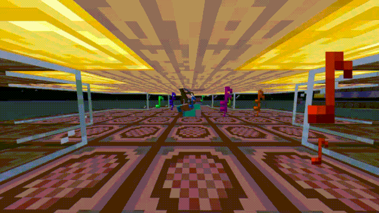

<h1 align='center'>
  MC-Uta
</h1>

<p align='center'>


</p>
<p align='center'><i>A mineflayer plugin allowing for advanced interaction with note blocks.</i></p>

---
## Installation
This plugin requires npm to install:<br>
`npm install -g mc-uta`

## Preview


## Features
- Discover nearby note blocks and determine sound & pitch
- Import MIDI files and play them in-game using note blocks
- Automatically tune note blocks based on MIDI key range

## Example
ES6:<br>
```javascript
import { mc_uta } from 'mc-uta';
import * as mineflayer from 'mineflayer';

let bot = mineflayer.createbot({
username: "robo",
});

let uta = mc_uta.plugin(bot);

bot.once('login', () => 
setTimeout(() => {
let note_blocks = uta.retreiveNearbyNoteBlocks();
uta.playMidi('midi/teddybear.mid', note_blocks);
}, 5 * 1000));
```

## Usage
- <i>Coming soon!</i>
